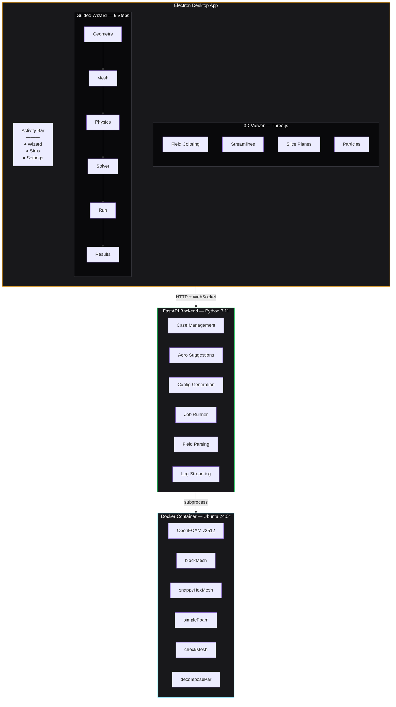

<p align="center">
  
</p>

<h1 align="center">FoamPilot</h1>

<p align="center">
  <strong>Aerodynamics made simple — guided OpenFOAM simulations.</strong>
</p>

<p align="center">
  <a href="#install">Install</a> &bull;
  <a href="#features">Features</a> &bull;
  <a href="#screenshots">Screenshots</a> &bull;
  <a href="#quick-start">Quick Start</a> &bull;
  <a href="#architecture">Architecture</a> &bull;
  <a href="#templates">Templates</a> &bull;
  <a href="#api-reference">API</a> &bull;
  <a href="#contributing">Contributing</a> &bull;
  <a href="#license">License</a>
</p>

<p align="center">
  
  
  
  
  
  
</p>

---

## Install

**One download. One click. OpenFOAM just works.**

No compiling OpenFOAM from source. No Linux partition. No SaaS subscription. FoamPilot ships as a native desktop installer that bundles everything — including a Docker-managed OpenFOAM backend that sets itself up automatically on first launch.

### Download

| Platform | Installer | Size |
|---|---|---|
| **Windows** | [`FoamPilot-Setup.exe`](https://github.com/olaafrossi/FoamPilot/releases/latest) | ~90 MB |
| **macOS** | [`FoamPilot.dmg`](https://github.com/olaafrossi/FoamPilot/releases/latest) | ~90 MB |
| **Linux** | [`FoamPilot.AppImage`](https://github.com/olaafrossi/FoamPilot/releases/latest) | ~90 MB |

> **Windows users:** FoamPilot auto-installs WSL2 and Docker Desktop for you — no manual setup required. macOS and Linux users need [Docker Desktop](https://www.docker.com/products/docker-desktop/) (free for personal use, education, and small business).

### What happens when you launch

```
 Install FoamPilot (.exe / .dmg / .AppImage)
           │
           ▼
 Launch the app ── first run triggers Setup screen
           │
           ▼
 ✔ Installs WSL2 + Docker Desktop (Windows, automatic)
           │
           ▼
 ✔ Updates WSL kernel to latest version
           │
           ▼
 ✔ Pulls the OpenFOAM container image (~2 GB, one time)
           │
           ▼
 ✔ Starts the backend server on localhost:8000
           │
           ▼
 Ready — start your first simulation
```

The **Setup screen** walks you through each step with live progress. On Windows, FoamPilot handles the full WSL2 and Docker Desktop installation — including a guided reboot after WSL setup. After first launch, the container image is cached locally — subsequent starts take seconds.

<p align="center">
  
</p>
<p align="center"><em>First-launch setup: FoamPilot detects Docker, pulls the OpenFOAM image, and starts the backend — all automatically.</em></p>

### Auto-updates

Both the desktop app and the backend container update independently:

- **App updates** — delivered via GitHub Releases through `electron-updater`. Downloads in the background, installs on next restart.
- **Container updates** — FoamPilot checks GitHub Releases for newer container image tags on GHCR and offers a one-click upgrade from the Settings page. No manual `docker pull` needed.

### Why not a SaaS?

CFD simulations are compute-heavy and data-heavy. Uploading meshes to a cloud server, paying per core-hour, and waiting for results to download adds cost and latency that doesn't make sense for learning and iteration. FoamPilot runs **entirely on your machine** — your geometry stays local, your cores stay busy, and you pay nothing beyond the hardware you already own.

---

## What is FoamPilot?

FoamPilot is a desktop application that wraps the power of [OpenFOAM](https://www.openfoam.com/) in a guided, visual interface. No more editing dozens of dictionary files by hand or memorizing command-line incantations. A **6-step wizard** walks you from geometry upload through mesh generation, physics setup, solver configuration, live run monitoring, and interactive 3D results — all from one window.

Built for **engineering students, CFD hobbyists, and aerodynamics researchers** who want to run real simulations without the steep learning curve.

### Why FoamPilot?

| Pain point | FoamPilot solution |
|---|---|
| OpenFOAM has 100+ dictionary files | Auto-generates configs from smart defaults |
| Mesh sizing is a dark art | Aero intelligence engine suggests domain size, refinement, y+ |
| No built-in GUI | VS Code-style desktop app with 3D visualization |
| Results require ParaView expertise | Built-in field rendering, streamlines, slice planes |
| Setup requires Linux | Dockerized backend runs on Windows, macOS, and Linux |

---

## Features

### Guided Simulation Wizard

A 6-step workflow that takes you from raw geometry to aerodynamic results:

| Step | What it does |
|---|---|
| **1. Geometry** | Upload STL/OBJ files or pick from built-in templates. Auto-classifies shape (streamlined / bluff / complex) and suggests parameters. |
| **2. Mesh** | Configure domain extents, surface refinement, and prism layers. See estimated cell count before committing. |
| **3. Physics** | Set boundary conditions, turbulence model (k-omega SST), inlet velocity. Edit any OpenFOAM dictionary in a Monaco editor with syntax highlighting. |
| **4. Solver** | Choose solver (simpleFoam, icoFoam), set iteration count, convergence criteria, under-relaxation. |
| **5. Run** | Submit to the Docker backend. Watch residuals converge in real-time via WebSocket log streaming. Cancel anytime. |
| **6. Results** | Explore fields in 3D — surface coloring, slice planes, streamlines with particle animation, point probing. View Cd/Cl/Cm force coefficients. |

### Aero Intelligence Engine

FoamPilot doesn't just run your simulation — it helps you set it up correctly.

- **Geometry classification** — analyzes your STL bounding box to determine characteristic length, frontal area, and aspect ratio
- **Parameter suggestions** — recommends mesh density, domain multipliers, turbulence quantities, and convergence targets based on Reynolds number
- **y+ calculator** — computes first cell height for your target y+ and velocity
- **Convergence prediction** — estimates iteration count and flags risk factors

### 3D Visualization

Built on Three.js + React Three Fiber:

- **Field coloring** — map pressure, velocity, k, omega onto the mesh surface with viridis/plasma/cool/warm colormaps
- **Slice planes** — drag an interactive cutting plane along x, y, or z to see internal flow structure
- **Streamlines** — RK4-integrated particle paths with animated tracers
- **Split view** — compare two fields side-by-side with independent cameras
- **Point probing** — click any surface point to read field values

### Case Management

- Create cases from 7 built-in templates (each with learning objectives and step-by-step guidance)
- Clone cases for parametric studies
- Browse and edit any OpenFOAM dictionary file
- Open in ParaView with one click
- Stock OpenFOAM tutorials bundled for verification (airFoil2D, motorBike)

### Real-Time Monitoring

- WebSocket-powered live log streaming
- Parsed residual plots (recharts) updating every iteration
- Job status tracking with amber pulse animation
- Elapsed time display

---

## Screenshots

> **Placeholder screenshots** — replace these with actual application captures.

### Wizard — Geometry Step
<p align="center">
  
</p>
<p align="center"><em>Upload STL geometry with real-time 3D preview. Auto-classifies shape and suggests simulation parameters.</em></p>

### Wizard — Mesh Configuration
<p align="center">
  
</p>
<p align="center"><em>Configure domain sizing, surface refinement, and prism layers. Estimated cell count shown before meshing.</em></p>

### Wizard — Physics & Boundary Conditions
<p align="center">
  
</p>
<p align="center"><em>Edit boundary conditions with OpenFOAM syntax highlighting. Turbulence model and inlet velocity configuration.</em></p>

### Wizard — Run & Monitor
<p align="center">
  
</p>
<p align="center"><em>Real-time residual convergence plot with live log streaming via WebSocket.</em></p>

### Results — 3D Field Visualization
<p align="center">
  
</p>
<p align="center"><em>Pressure field on motorbike surface with viridis colormap. Drag to rotate, scroll to zoom.</em></p>

### Results — Streamlines
<p align="center">
  
</p>
<p align="center"><em>RK4-integrated streamlines with animated particles showing flow around the geometry.</em></p>

### Results — Slice Plane
<p align="center">
  
</p>
<p align="center"><em>Drag the slice plane through the domain to reveal internal velocity structure.</em></p>

### My Simulations
<p align="center">
  
</p>
<p align="center"><em>Browse, clone, and manage simulation cases. Quick actions for ParaView and re-running.</em></p>

### Dark UI Overview
<p align="center">
  
</p>
<p align="center"><em>VS Code-inspired layout: Activity Bar, Sidebar, Editor area, and Status Bar with amber "pilot light" accent.</em></p>

---

## Quick Start

### Prerequisites

- [Docker Desktop](https://www.docker.com/products/docker-desktop/) (auto-installed on Windows; manual install on macOS/Linux)
- [Node.js](https://nodejs.org/) 20+ (for frontend development)
- [Python](https://www.python.org/) 3.11+ (for backend development, or use Docker)

### Option 1: Docker (Recommended)

```bash
# Clone the repository
git clone https://github.com/OlaafRossi/FoamPilot.git
cd FoamPilot

# Start the backend (pulls OpenFOAM v2512 image)
cd docker
docker compose -f docker-compose.prod.yml up -d

# Start the frontend
cd ../electron-ui
npm install
npm run dev:electron
```

The backend runs on `http://localhost:8000` and the Electron app connects automatically.

### Option 2: Development Setup

```bash
# Backend
cd backend
pip install -r requirements.txt
uvicorn main:app --reload --port 8000

# Frontend (in another terminal)
cd electron-ui
npm install
npm run dev:electron
```

### Configuration

Resource settings (cores, CPU limit, memory) are configurable from the **Settings** page inside the app. Changes are written to the `.env` file and applied on backend restart.

Environment variables in `.env` (managed by the app):

| Variable | Default | Description |
|---|---|---|
| `FOAMPILOT_VERSION` | `latest` | Container image tag |
| `FOAMPILOT_PORT` | `8000` | Backend API port |
| `FOAMPILOT_CASES` | (auto) | Path to simulation case storage |
| `FOAMPILOT_TEMPLATES` | (auto) | Path to built-in templates |
| `FOAM_CORES` | `4` | Parallel decomposition for OpenFOAM (mpirun -np) |
| `DOCKER_CPUS` | `4` | CPU cores allocated to container |
| `DOCKER_MEMORY` | `8g` | Memory allocated to container |

---

## Architecture



### Tech Stack

| Layer | Technology | Version |
|---|---|---|
| **Desktop Shell** | Electron | 41.0 |
| **Auto-Update** | electron-updater | 6.3 |
| **Frontend** | React + TypeScript | 19.2 / 6.0 |
| **Routing** | React Router | 7.13 |
| **Build** | Vite | 8.0 |
| **Styling** | Tailwind CSS | 4.2 |
| **3D Engine** | Three.js + React Three Fiber + Drei | 0.183 / 9.5 / 10.7 |
| **Code Editor** | Monaco Editor | 4.7 |
| **Charts** | Recharts | 3.8 |
| **Backend** | FastAPI + Uvicorn | 0.115 |
| **Validation** | Pydantic | 2.x |
| **Simulation** | OpenFOAM (ESI) | v2512 |
| **Container** | Docker + Compose | Latest |
| **Base Image** | Ubuntu | 24.04 |

---

## Project Structure

```
FoamPilot/
├── electron-ui/               # Desktop frontend
│   ├── src/
│   │   ├── pages/             # Top-level routes
│   │   │   ├── WizardPage     #   Guided 6-step workflow
│   │   │   ├── MySimulations  #   Case browser & management
│   │   │   ├── SetupPage      #   Docker/backend first-run setup
│   │   │   └── SettingsPage   #   App + resource configuration
│   │   ├── steps/             # Wizard step components
│   │   │   ├── GeometryStep   #   STL/OBJ upload + 3D preview
│   │   │   ├── MeshStep       #   Domain & refinement config
│   │   │   ├── PhysicsStep    #   Boundary conditions editor
│   │   │   ├── SolverStep     #   Solver & convergence setup
│   │   │   ├── RunStep        #   Job submission & monitoring
│   │   │   └── ResultsStep    #   3D visualization & forces
│   │   ├── components/        # Reusable UI components
│   │   │   ├── MeshPreview         # STL/OBJ 3D viewer
│   │   │   ├── VisualizationPanel  # Field rendering orchestrator
│   │   │   ├── FieldMeshRenderer   # Surface field coloring
│   │   │   ├── SlicePlaneRenderer  # Interactive slice planes
│   │   │   ├── StreamlineRenderer  # Particle-traced streamlines
│   │   │   ├── ParticleRenderer    # Animated particle paths
│   │   │   ├── GeometryOutline     # Wireframe overlay
│   │   │   ├── SceneCompositor     # 3D scene composition
│   │   │   ├── SplitView           # Dual-field comparison
│   │   │   ├── ProbeHandler        # Point probing interaction
│   │   │   ├── ScreenshotButton    # Viewport capture
│   │   │   ├── LogViewer           # Real-time log display
│   │   │   ├── FoamEditor          # Monaco dict editor
│   │   │   └── WizardStepper       # Progress indicator
│   │   ├── hooks/             # React hooks
│   │   ├── lib/               # Utilities (streamlines, colormaps)
│   │   ├── api.ts             # HTTP + WebSocket client
│   │   └── types.ts           # TypeScript interfaces
│   └── electron/
│       ├── main.ts            # Electron main process + IPC handlers
│       ├── preload.ts         # Context bridge (window.foamPilot API)
│       └── docker-manager.ts  # Docker/WSL lifecycle management
│
├── backend/                   # Python API server
│   ├── routers/               # Endpoint groups
│   │   ├── cases.py           #   Case CRUD operations
│   │   ├── runner.py          #   Job execution & streaming
│   │   ├── files.py           #   Dictionary file I/O
│   │   ├── geometry.py        #   Geometry upload & transforms
│   │   ├── pipeline.py        #   Wizard state machine
│   │   └── suggestions.py     #   Aero intelligence engine
│   ├── services/              # Business logic
│   │   ├── aero_suggestions   #   Parameter recommendation
│   │   ├── config_generator   #   OpenFOAM dict generation
│   │   ├── field_parser       #   Field data extraction
│   │   ├── foam_runner        #   Async job management
│   │   ├── geometry           #   Shape classification
│   │   ├── pipeline_service   #   Multi-step orchestration
│   │   ├── log_parser         #   Simulation log analysis
│   │   └── parsers            #   Output parsing utilities
│   └── main.py                # FastAPI app entry
│
├── docker/                    # Container config
│   ├── Dockerfile             # Ubuntu 24.04 + OpenFOAM v2512
│   ├── docker-compose.yml     # Development (mounts local code)
│   └── docker-compose.prod.yml # Production (GHCR image)
│
├── templates/                 # Built-in case templates
│   ├── motorBike/             #   External aero (ground vehicle)
│   ├── airFoil2D/             #   2D airfoil (learning)
│   ├── cavity/                #   Driven cavity (intro)
│   ├── pitzDaily/             #   Backward step
│   ├── fixedWingDrone/        #   UAV wing
│   ├── smallPlane/            #   Fixed-wing aircraft
│   └── raceCar/               #   Automotive aero
│
├── .github/workflows/         # CI/CD
│   ├── release.yml            #   Auto-build on tag push (Electron + Docker)
│   └── manual-release.yml     #   Manual test releases
│
└── cases/                     # User simulation data
```

---

## Templates

FoamPilot ships with 7 ready-to-run simulation templates:

| Template | Solver | Category | Description |
|---|---|---|---|
| **motorBike** | simpleFoam | External Aero | Classic OpenFOAM tutorial — ground vehicle aerodynamics with snappyHexMesh |
| **airFoil2D** | simpleFoam | Learning | 2D airfoil for lift/drag studies. Great starting point. |
| **cavity** | icoFoam | Learning | Lid-driven cavity — the "Hello World" of CFD |
| **pitzDaily** | simpleFoam | Learning | Backward-facing step with turbulent separation |
| **fixedWingDrone** | simpleFoam | External Aero | UAV wing in freestream — small Reynolds number aero |
| **smallPlane** | simpleFoam | External Aero | Fixed-wing aircraft aerodynamics |
| **raceCar** | simpleFoam | External Aero | Automotive external aero with ground effect |

Each template includes complete `system/`, `constant/`, and `0/` directories with tuned defaults. Upload your own geometry and the aero engine will adapt the parameters automatically.

---

## API Reference

The FastAPI backend exposes a REST + WebSocket API on port 8000.

<details>
<summary><strong>Cases</strong></summary>

| Method | Endpoint | Description |
|---|---|---|
| `GET` | `/cases` | List all simulation cases |
| `POST` | `/cases` | Create case from template |
| `GET` | `/cases/{name}` | Get case details |
| `DELETE` | `/cases/{name}` | Delete a case |
| `POST` | `/cases/{name}/clone` | Clone for parametric study |
| `GET` | `/cases/{name}/solver` | Get solver application name |

</details>

<details>
<summary><strong>Files</strong></summary>

| Method | Endpoint | Description |
|---|---|---|
| `GET` | `/cases/{name}/files` | List dictionary files |
| `GET` | `/cases/{name}/file?path=...` | Read file content |
| `PUT` | `/cases/{name}/file?path=...` | Write file content |

</details>

<details>
<summary><strong>Jobs & Execution</strong></summary>

| Method | Endpoint | Description |
|---|---|---|
| `POST` | `/run` | Start a simulation job |
| `GET` | `/jobs` | List all jobs |
| `GET` | `/jobs/{id}` | Get job status |
| `DELETE` | `/jobs/{id}` | Cancel running job |
| `GET` | `/jobs/{id}/log` | Full log output |
| `GET` | `/jobs/{id}/residuals` | Parsed residual data |
| `WS` | `/logs/{id}` | Real-time log stream |

</details>

<details>
<summary><strong>Geometry & Intelligence</strong></summary>

| Method | Endpoint | Description |
|---|---|---|
| `POST` | `/cases/{name}/upload-geometry` | Upload STL/OBJ + auto-configure |
| `GET` | `/cases/{name}/classify` | Classify geometry shape |
| `GET` | `/cases/{name}/suggest?velocity=...` | Full parameter suggestions |
| `GET` | `/cases/{name}/y-plus?velocity=...` | Calculate first cell height |
| `GET` | `/cases/{name}/reynolds?velocity=...` | Calculate Reynolds number |

</details>

<details>
<summary><strong>Pipeline (Wizard State)</strong></summary>

| Method | Endpoint | Description |
|---|---|---|
| `POST` | `/pipeline/create` | Create guided pipeline |
| `GET` | `/pipeline/{case}` | Get pipeline state |
| `POST` | `/pipeline/{case}/advance` | Advance to next step |
| `POST` | `/pipeline/{case}/validate` | Validate current step |
| `POST` | `/pipeline/{case}/reset/{step}` | Reset to earlier step |
| `GET` | `/templates` | List templates with metadata |

</details>

Interactive API docs are available at `http://localhost:8000/docs` (Swagger UI) when the backend is running.

---

## Design System

FoamPilot uses a **warm amber + zinc** palette inspired by industrial instrumentation. The amber accent serves as the "pilot light" — it glows when your simulation is alive.

| Element | Color | Hex |
|---|---|---|
| Editor background | Zinc 950 | `#09090B` |
| Sidebar background | Zinc 900 | `#18181B` |
| Accent / Active | Amber 500 | `#F59E0B` |
| Primary text | Zinc 50 | `#FAFAFA` |
| Muted text | Zinc 500 | `#71717A` |
| Success | Green 500 | `#22C55E` |
| Error | Red 500 | `#EF4444` |
| Warning | Yellow 500 | `#EAB308` |

**Typography:** Satoshi (headings), Segoe UI (body), Cascadia Code (editor/logs)

Full design specification in [`DESIGN.md`](DESIGN.md).

---

## Development

### Frontend

```bash
cd electron-ui
npm install
npm run dev              # Vite dev server on :5173
npm run dev:electron     # Full Electron app with hot reload
npm run build:electron   # Package distributable
npm run test             # Run Vitest tests
```

### Backend

```bash
cd backend
pip install -r requirements.txt
uvicorn main:app --reload --port 8000
```

### Docker

```bash
cd docker

# Development (mounts local code, live reload via uvicorn --reload)
docker compose up --build

# Production (pre-built image from GHCR)
docker compose -f docker-compose.prod.yml up -d
```

---

## Contributing

1. Fork the repository
2. Create a feature branch (`git checkout -b feature/my-feature`)
3. Make your changes
4. Run tests (`cd electron-ui && npm test`)
5. Submit a pull request

Please read [`DESIGN.md`](DESIGN.md) before making UI changes to stay consistent with the design system.

---

## License

[MIT](LICENSE) &copy; 2026 Olaaf Rossi

---

<p align="center">
  <sub>Built with OpenFOAM, Electron, React, FastAPI, and Three.js</sub>
</p>
